# Food Delivery Service - Product Metrics Analysis

SQL analytics project for a simulated food delivery platform.

The project explores user acquisition, customer retention, order dynamics, courier efficiency, and revenue monetization using PostgreSQL. The final result is an interactive dashboard built in Redash and a collection of reusable SQL queries for product analytics.

## Tech Stack

- PostgreSQL
- SQL
- Redash
- Window Functions
- Common Table Expressions (CTEs)
- Data Visualization

## Dataset

**Source:** Simulated Food Delivery Service database (Karpov.Courses)

**Analyzed Period:** August - September 2022

### Tables Used

| Table | Description |
|--------|-------------|
| `orders` | Order information, timestamps and product IDs |
| `products` | Product catalog with prices |
| `user_actions` | User activity log (orders, cancellations, etc.) |
| `courier_actions` | Courier activity log (acceptance and delivery) |
| `users` | User demographic information |
| `couriers` | Courier demographic information |

# Dashboard

The SQL queries were combined into an interactive Redash dashboard covering audience growth, operational performance, and revenue metrics.

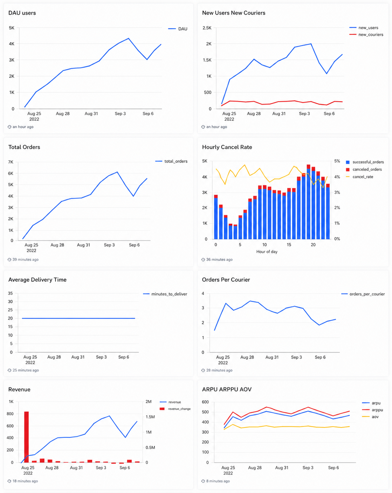

# Table of Contents

1. [Analysis](#analysis)

&nbsp;&nbsp;&nbsp;&nbsp;1.1 [Audience Metrics](#audience-metrics)

&nbsp;&nbsp;&nbsp;&nbsp;1.2 [Order Metrics](#order-metrics)

&nbsp;&nbsp;&nbsp;&nbsp;1.3 [Revenue & Monetization](#revenue--monetization)

2. [SQL Techniques Used](#sql-techniques-used)

3. [Key Findings](#key-findings)

4. [Skills Demonstrated](#skills-demonstrated)

# Analysis

## Audience Metrics

### DAU / WAU / MAU

**SQL:** [`01_dau_wau_mau.sql`](queries/01_dau_wau_mau.sql)

Calculates the number of unique users who performed at least one action per day, week, and month.

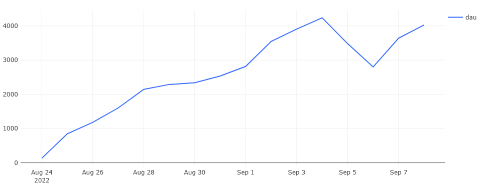
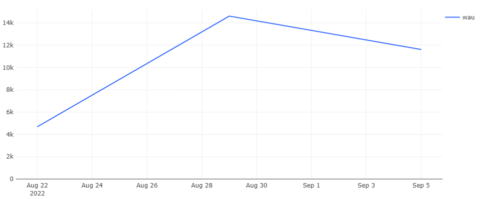
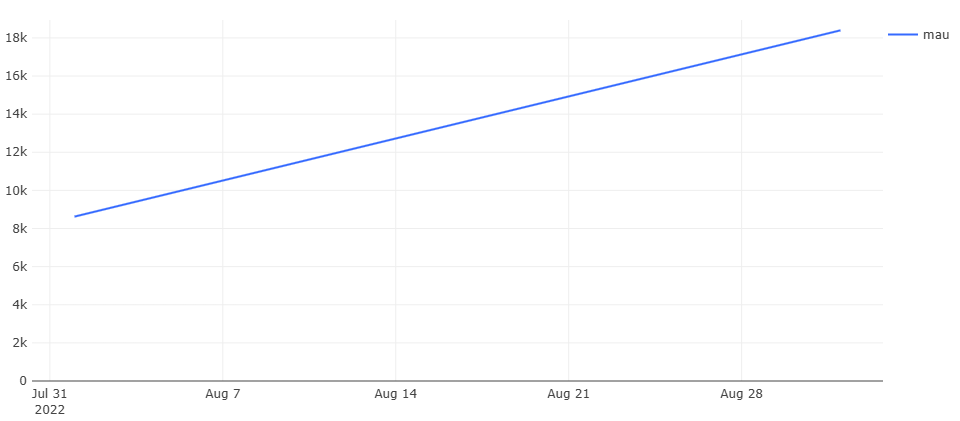

**Key Insight**

User activity grew steadily throughout the analyzed period with no significant declines.

### New Users and Couriers + Cumulative Totals

**SQL:** [`02_new_users_couriers_and_totals.sql`](queries/02_new_users_couriers_and_totals.sql)

Tracks first appearance of each user and courier using MIN(time).
Cumulative totals calculated with SUM() window function.
FULL JOIN with COALESCE ensures no dates are lost when user and courier data don't overlap.

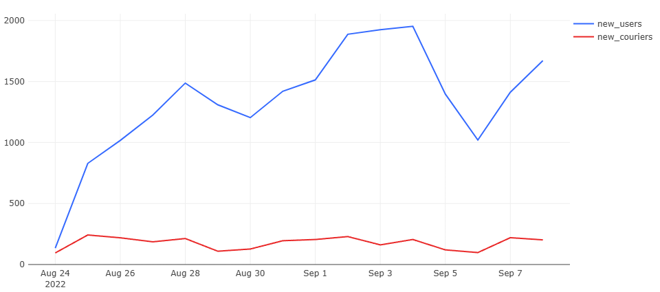
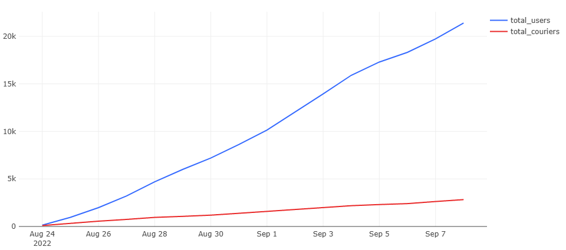

**Key Insight**

Audience grew steadily throughout the period. Courier supply kept pace with user growth.

### Audience Growth Rate

**SQL:** [`03_growth_rate.sql`](queries/03_growth_rate.sql)

Day-over-day percentage change in new and total users and couriers.
Calculated using LAG() window function.

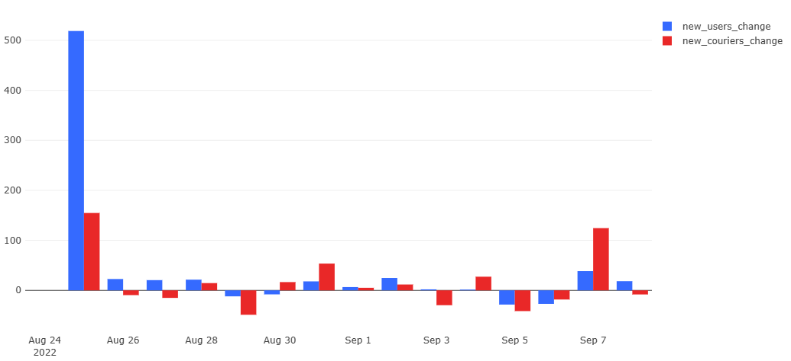
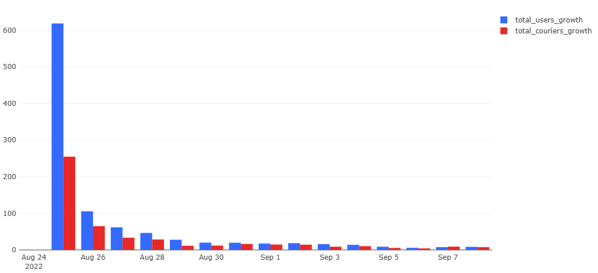

**Key Insight**

Both user and courier growth rates gradually declined after the initial launch. Courier growth remained more stable, while user acquisition fluctuated more significantly, reflecting varying customer demand and marketing impact.

### Paying Users and Active Couriers

**SQL:** [`04_paying_users_active_couriers.sql`](queries/04_paying_users_active_couriers.sql)

Paying users – those with at least one non-cancelled order. Active couriers – those who both accepted and delivered at least one order.

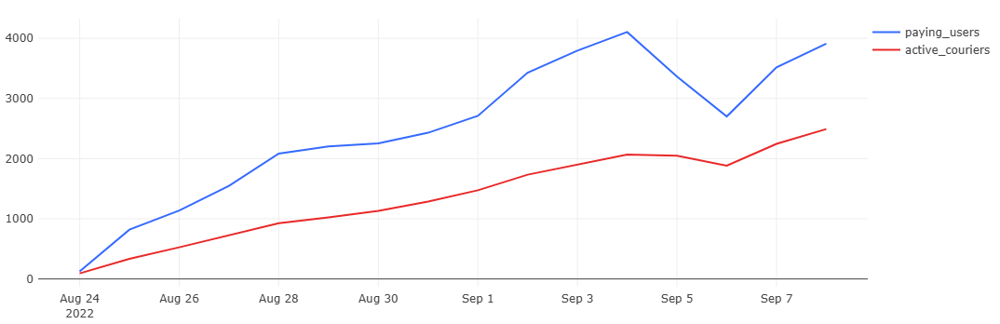
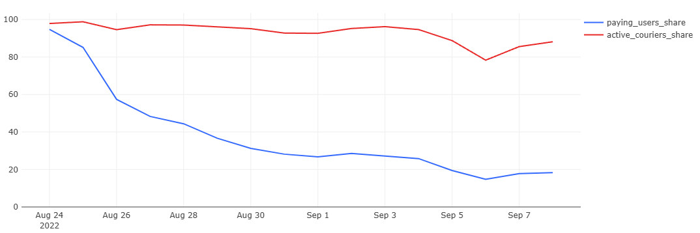

**Key Insight**

The share of paying users gradually declines as new users join but do not immediately place orders. Courier engagement share remains high and stable throughout the period.

### Single vs Multiple Orders per Day

**SQL:** [`05_single_vs_multiple_orders.sql`](queries/05_single_vs_multiple_orders.sql)

Share of paying users who placed exactly one order vs more than one order on a given day.

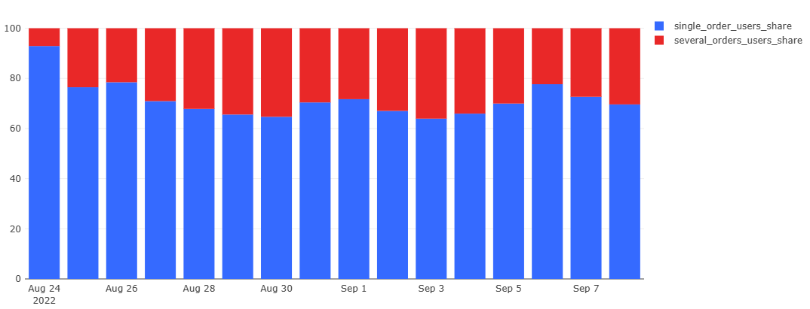

**Key Insight**

The majority of paying users place a single order per day. The share of multi-order users remains relatively small but consistent.

# Order Metrics

### First Orders and New User Orders

**SQL:** [`06_first_new_users_orders.sql`](queries/06_first_new_users_orders.sql)

Tracks total orders, first-time orders, and orders placed by users on their registration day.

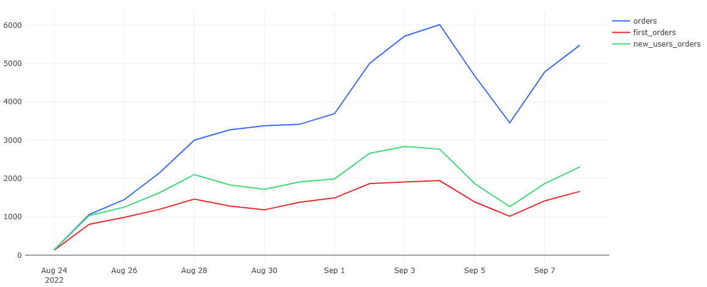
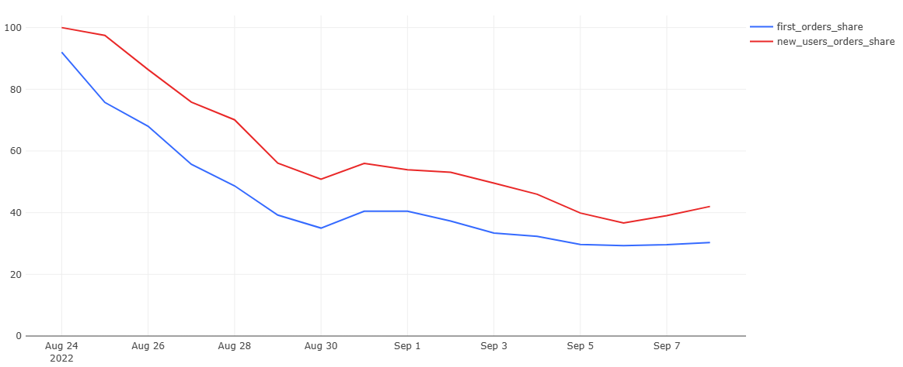

**Key Insight**

As the service matures, the share of first orders in total orders gradually declines – a healthy sign that returning users account for a growing portion of activity.

### Courier Load

**SQL:** [`07_courier_load.sql`](queries/07_courier_load.sql)

Ratio of paying users and total orders to active couriers per day.

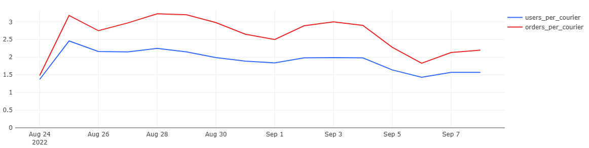

**Key Insight**

Both metrics decline over time, suggesting courier supply is growing faster than demand. Additional data on target utilization rates would be needed to assess whether current load is optimal.

### Average Delivery Time

**SQL:** [`08_delivery_time.sql`](queries/08_delivery_time.sql)

Time between order acceptance and delivery in minutes. Calculated using EXTRACT(EPOCH FROM interval) / 60. Cancelled orders excluded.

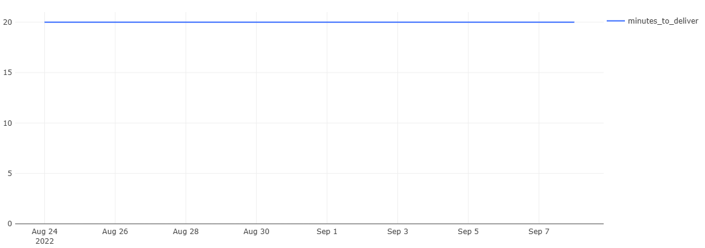

**Key Insight**

Average delivery time remains consistently around 20 minutes – indicating stable service quality.

### Hourly Order Volume & Cancel Rate

**SQL:** [`09_hourly_cancel_rate.sql`](queries/09_hourly_cancel_rate.sql)

Orders and cancellations grouped by hour of day.

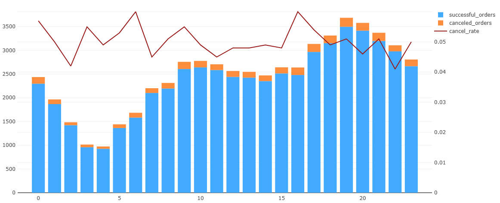

**Key Insight**

Peak order volume at 19:00-20:00. Cancel rate does not increase during peak hours, suggesting the service handles high load without a rise in cancellations.

# Revenue & Monetization

### Daily Revenue + Running Revenue + Growth Rate

**SQL:** [`10_revenue_growth.sql`](queries/10_revenue_growth.sql)

Revenue calculated by unnesting the product_ids array and joining with the products table.
Growth rate calculated using LAG() window function.

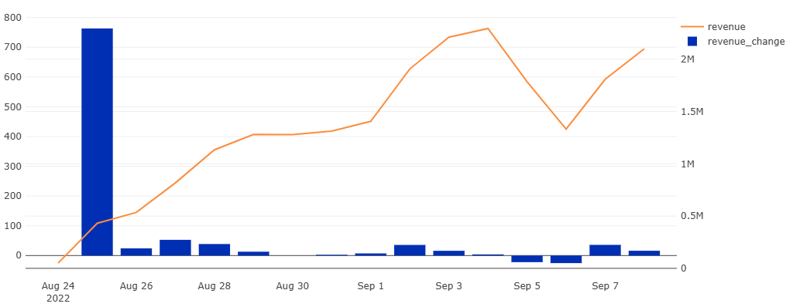
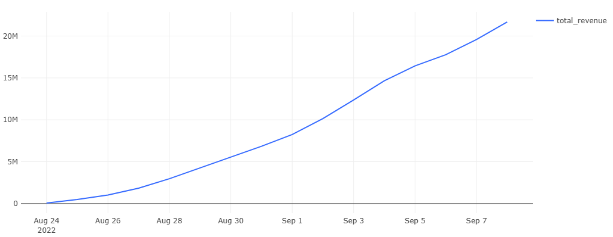

**Key Insight**

A revenue dip on September 6 aligns with a broader drop in order volume observed across all metrics.

### ARPU / ARPPU / AOV

**SQL:** [`11_arpu_arppu_aov.sql`](queries/11_arpu_arppu_aov.sql)

ARPU – average revenue per user (all users)
ARPPU – average revenue per paying user
AOV – average order value

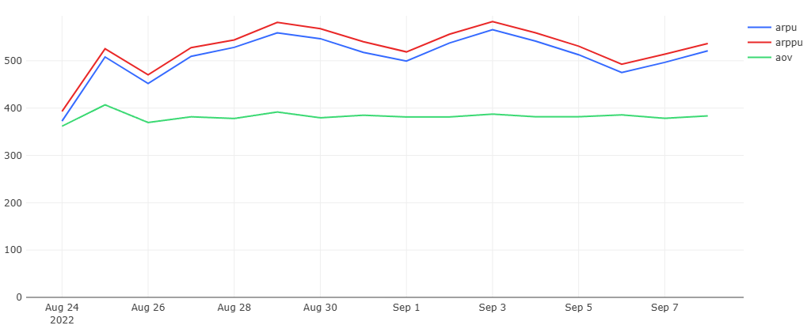

**Key Insight**

AOV is the most stable metric. ARPU and ARPPU move in parallel, indicating the share of paying users among all users remains relatively constant.

### Running ARPU / ARPPU / AOV

**SQL:** [`12_running_metrics.sql`](queries/12_running_metrics.sql)

Cumulative versions of the above metrics, recalculated daily using window functions.

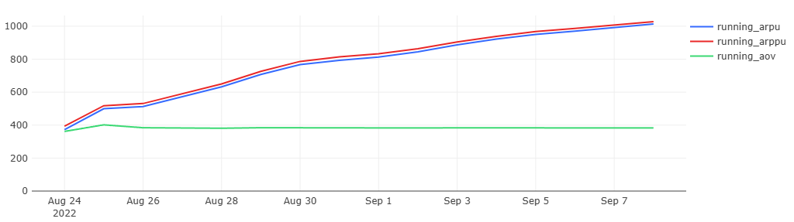

**Key Insight**

Growing Running ARPU alongside a stable Running AOV suggests users are placing more orders over time rather than spending more per order – a sign of increasing engagement.

### Weekday Monetization

**SQL:** [`13_weekday_metrics.sql`](queries/13_weekday_metrics.sql)

Metrics broken down by weekday using TO_CHAR and EXTRACT(ISODOW).
Date range: two full weeks (2022-08-26 to 2022-09-08).

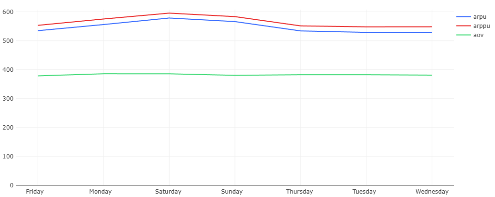

**Key Insight**

ARPU and ARPPU peak on Saturday, consistent with typical food delivery behavior – users order more on weekends.

### New vs Returning User Revenue

**SQL:** [`14_new_vs_returning_revenue.sql`](queries/14_new_vs_returning_revenue.sql)

Daily revenue split between first-time and existing users.

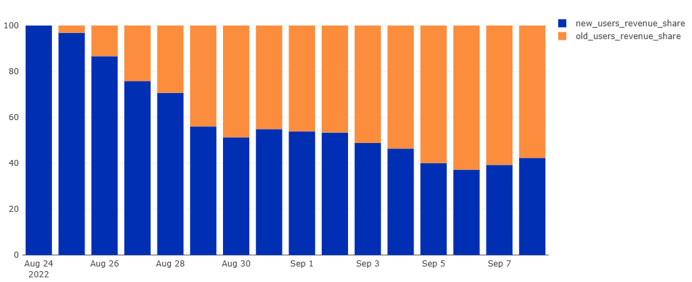

**Key Insight**

New user revenue share gradually declines as the service grows – existing users account for an increasing portion of total revenue, a healthy retention signal.

### Top Products by Revenue

**SQL:** [`15_top_products.sql`](queries/15_top_products.sql)

Revenue and share per product over the entire period.
Products with less than 0.5% share grouped into Other using CASE WHEN in GROUP BY.

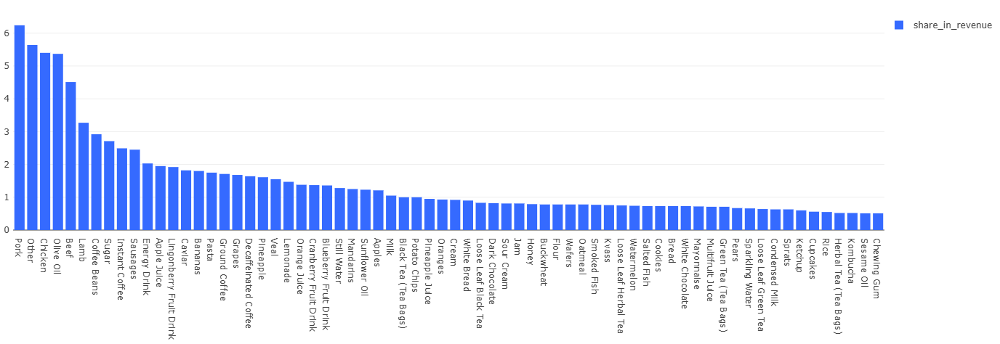

**Key Insight**

Pork, chicken, olive oil, and beef are the top revenue-generating products. Meat products collectively dominate revenue across categories.

# SQL Techniques Used

| Technique | Application |
|-----------|-------------|
| Window Functions (`SUM`, `LAG`) | Running totals, cumulative metrics and growth rates |
| Common Table Expressions (`WITH`) | Multi-step query decomposition |
| `UNNEST(product_ids)` | Revenue calculation |
| `DATE_TRUNC`, `EXTRACT`, `TO_CHAR` | Time aggregations |
| `EXTRACT(EPOCH)` | Delivery time calculation |
| `FULL JOIN` + `COALESCE` | Preserving all dates |
| `CASE WHEN` | Grouping low-volume products |
| Subqueries | Excluding cancelled orders |

# Key Findings

- User activity increased steadily throughout the analyzed period.
- Courier supply expanded faster than demand toward the end of the analysis.
- Most paying users place a single order per day.
- Average delivery time remained stable at approximately **20 minutes**.
- Peak demand occurs between **19:00–20:00** without increasing the cancellation rate.
- Returning users contribute an increasing share of total revenue.
- Saturday generates the highest ARPU and ARPPU.
- Pork, chicken, olive oil and beef are the leading revenue-generating products.

# Skills Demonstrated

- SQL Query Writing
- PostgreSQL
- Window Functions
- Common Table Expressions (CTEs)
- Data Aggregation
- Product Analytics
- Revenue Analysis
- Customer Retention Analysis
- Dashboard Development
- Data Visualization
